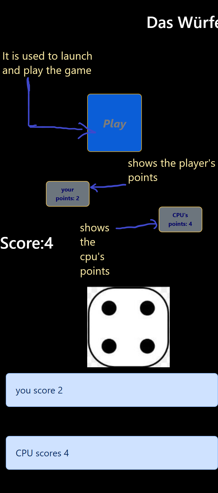
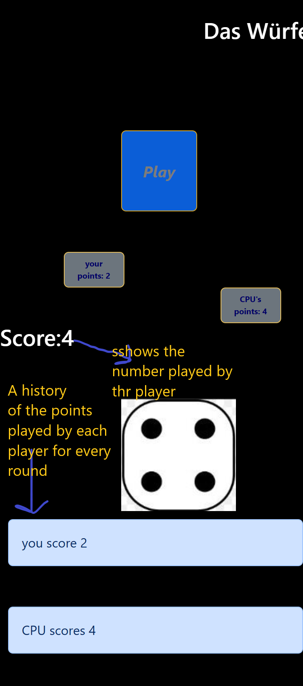
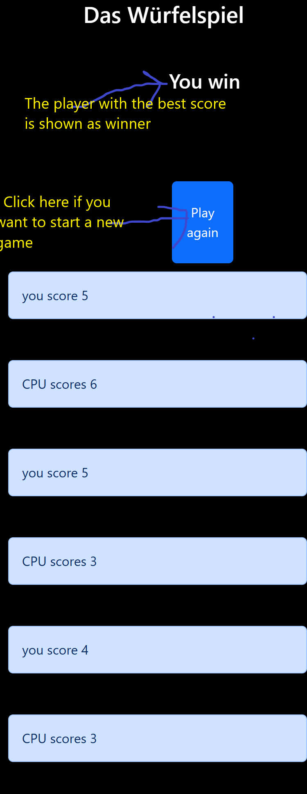

# Presentation of the app
 The game has three rounds and at the end of the Game the winner appears on the screen

## Components of the App
 

  The play button is used to  launch and to play the game.
  The buttons "your points" and "CPU's points" show the score of a every player after each turn 

## Dice and the scores for each turn

## The winner and the "play-again button"
 